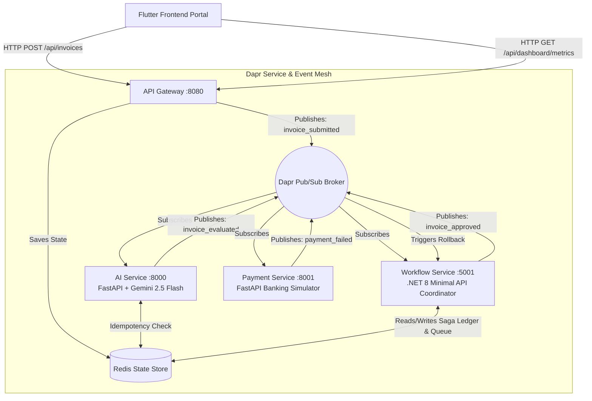
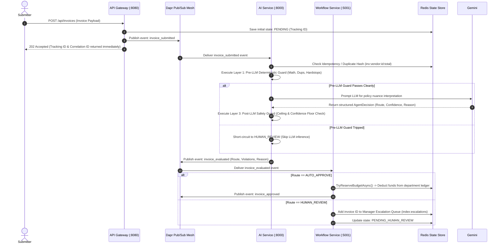
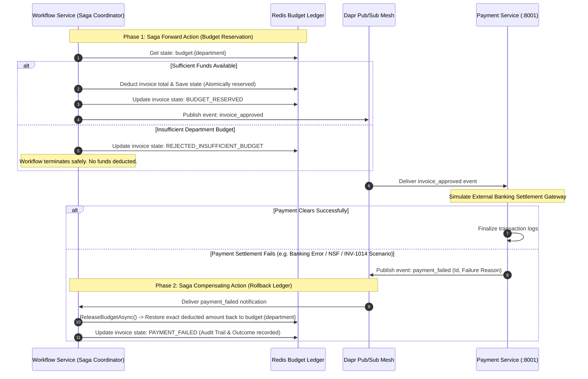

# ZioNet ApprovalFlow — System Architecture & Component Boundaries

This document outlines the physical microservice boundaries, event-driven choreography, and saga failure recovery patterns for the ZioNet ApprovalFlow platform.

---

## 1. System Component Boundaries

The platform is designed as a polyglot, event-driven microservice cluster choreographed via **Dapr (Distributed Application Runtime)** and backed by **Redis** for state persistence and message pub/sub.

### Microservice Responsibilities

1. **`api-gateway` (FastAPI / Python):** The single external ingress boundary. Enforces rate-limiting (`20 req/min`), validates payload schemas, generates non-blocking tracking IDs (`202 Accepted`), injects `X-Correlation-ID` headers, and exposes consolidated `/docs` OpenAPI endpoints.
2. **`workflow-service` (.NET 8 Minimal API / C#):** The central state machine and saga orchestrator. Manages invoice lifecycle transitions (`PENDING` -> `APPROVED` / `PENDING_HUMAN_REVIEW`), maintains atomic department budget balances in Redis, and manages the Human-in-the-Loop (HITL) escalation index (`index:escalations`).
3. **`ai-service` (FastAPI / Python + LangChain):** Evaluates expense policy compliance. Encapsulates the Google Gemini 2.5 Flash LLM within strict **Layer 1 (Pre-LLM)** and **Layer 3 (Post-LLM)** deterministic Python code guards to guarantee autonomy ceiling enforcement (`$250.00 USD`) regardless of LLM output.
4. **`payment-service` (FastAPI / Python):** Simulates external banking clearinghouses. Consumes approved invoices, executes simulated transaction delays, and broadcasts failure notifications (`payment_failed`) when settlement errors occur.
5. **`frontend` (Flutter / Dart):** Responsive web/desktop UI providing a submission form, real-time status tracker, manager escalation intervention dashboard (Approve/Reject/Send Back), and live executive metrics (Requirement F8).

---

## 2. Core Intake & Evaluation Sequence Diagram

This sequence illustrates the asynchronous intake pipeline and the triple-layer evaluation architecture protecting against LLM hallucination and prompt injection attacks.

---

## 3. Payment Flow & Compensating Rollback Sequence Diagram (Two-Phase Saga)

To guarantee exact financial consistency without distributed two-phase database locking (2PC), the system implements an event-driven **Two-Phase Saga** with compensating transaction rollbacks.

