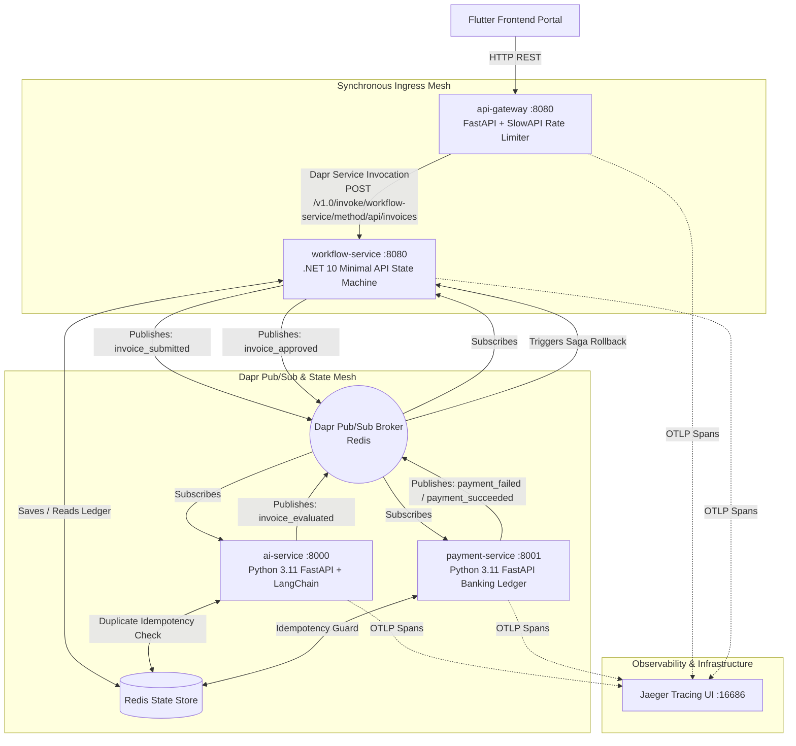
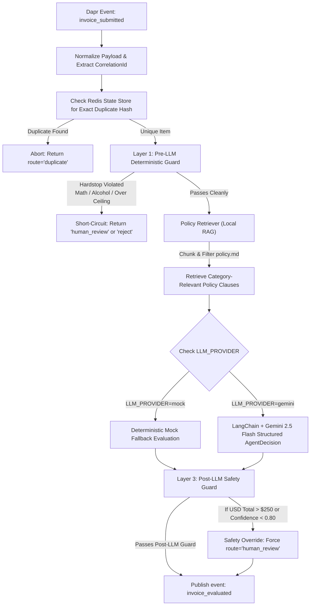
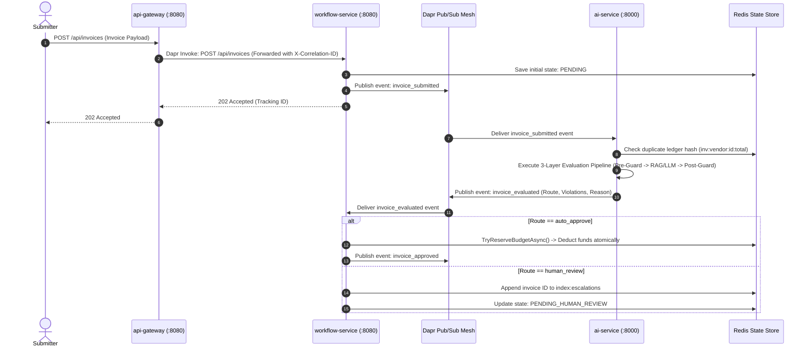
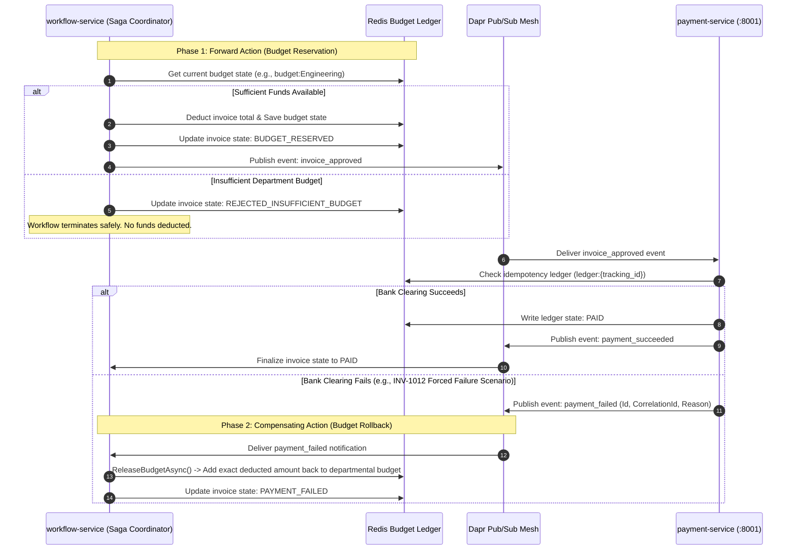

# ZioNet ApprovalFlow — System Architecture & Component Boundaries

This document defines the physical microservice boundaries, event-driven choreography, AI agent safety guards, and compensating saga recovery patterns for the ZioNet ApprovalFlow platform.

---

## 1. System Component Boundaries & Tech Stack

ApprovalFlow is structured as a polyglot, cloud-native microservice cluster orchestrated via **Dapr (Distributed Application Runtime v1.13)** and backed by **Redis Alpine** for distributed state persistence and pub/sub messaging.



### Microservice Responsibilities

1. **`api-gateway` (FastAPI / Python 3.11):** The single external ingress boundary. Enforces IP-based rate-limiting (`60 req/min` via SlowAPI), injects distributed `X-Correlation-ID` headers, handles CORS for Flutter web clients, and proxies business operations to `workflow-service` via Dapr Service Invocation.
2. **`workflow-service` (ASP.NET Core / .NET 10):** The primary state machine orchestrator. Ingests raw invoices (`202 Accepted`), persists initial state, publishes `invoice_submitted` events, manages departmental budget reservations (`TryReserveBudgetAsync`), and maintains the Human-in-the-Loop (HITL) escalation queue index (`index:escalations`).
3. **`ai-service` (FastAPI / Python 3.11 + LangChain):** The policy compliance evaluation engine. Executes a 3-layer zero-trust evaluation pipeline utilizing local keyword/section Retrieval-Augmented Generation (RAG) over `policy.md` and Google Gemini 2.5 Flash (with a swappable `mock` fallback provider).
4. **`payment-service` (FastAPI / Python 3.11):** Simulates external banking settlement gateways. Consumes approved invoices, enforces strict Redis ledger idempotency checks (`ledger:{id}`), and emits saga failure notifications (`payment_failed`) or success receipts (`payment_succeeded`).
5. **`frontend` (Flutter / Dart):** Responsive UI providing invoice submission forms, real-time status polling, manager escalation dashboards (Approve / Reject / Request More Info), and live audit trail visualizers.

---

## 2. Zero-Trust AI Agent Architecture

To prevent hallucinations, prompt injections, and unauthorized budget overruns, the AI service operates under a **router-decides safety posture**. The LLM acts strictly as an advisor; deterministic Python code gates the entry and exit of every evaluation.

### AI Evaluation Flow Diagram



### Detailed Safety Layers

* **Layer 1 — Pre-LLM Guard (Pure Code):** Intercepts submissions before LLM inference. Verifies exact math reconciliation (`LineItems + Tax == Total`), checks for missing receipts on totals over `$25 USD`, verifies known vendors, blocks non-reimbursable categories (e.g., alcohol-only items matching rule `MEAL-ALCOHOL`), and flags round-number fraud signals.
* **Layer 2 — RAG Policy Retriever & Advisory LLM:** `retriever.py` dynamically splits `policy.md` by Markdown headers and extracts clauses matching the invoice category and description keywords. This focused context is fed to Gemini alongside a strict Pydantic JSON schema (`AgentDecision`). If `LLM_PROVIDER=mock` or API keys are missing, the system swaps to a deterministic code path.
* **Layer 3 — Post-LLM Safety Net:** Enforces non-negotiable hard boundaries. If the LLM returns `auto_approve` for an invoice exceeding the `$250.00 USD` autonomy ceiling (`AUTONOMY_CEILING`), or if the AI's confidence score is `< 0.80`, the route is programmatically overridden to `human_review`.

---

## 3. Core End-to-End Choreography Sequence



---

## 4. Two-Phase Saga Payment & Compensating Rollback

To maintain strict accounting consistency across decoupled containers without distributed locking, the system executes an event-driven **Two-Phase Saga**.



---

## 5. Data Contracts & Event Schemas

All event payloads broadcast over Dapr Pub/Sub adhere to strict JSON contracts stamped with correlation headers.

### `invoice_submitted` (Published by `workflow-service`)

```json
{
  "Id": "INV-1001",
  "CorrelationId": "12385cbb-8a8c-4cbb-8bff-e9ed3fec80c8",
  "Payload": {
    "InvoiceNumber": "INV-1001",
    "Vendor": "Team Lunch Co",
    "Total": 45.00,
    "Currency": "USD",
    "Category": "meals",
    "ReceiptPresent": true,
    "LineItems": [{"Description": "Lunch buffet", "Quantity": 5, "UnitPrice": 9.00}],
    "Notes": "Engineering sprint planning meal"
  }
}

```

### `invoice_evaluated` (Published by `ai-service`)

```json
{
  "Id": "INV-1001",
  "Route": "auto_approve",
  "Violations": [],
  "Reason": "AI evaluation applied successfully. | LLM Rationale: Compliant meal expense under departmental cap. (Confidence: 0.95)"
}

```

---

## 6. Cloud-Native Reliability & Observability

* **Distributed Tracing (OpenTelemetry / Jaeger):** All services configure `OpenTelemetry` SDKs on boot. Python containers emit HTTP OTLP spans, while ASP.NET Core emits `HttpProtobuf` traces. Every request extracts and stamps `correlation_id` tags across boundaries, rendering end-to-end multi-service waterfall diagrams in Jaeger (`http://localhost:16686`).
* **Declarative Resiliency (`resiliency.yaml`):** The Dapr sidecars mount declarative outbox resiliency rules intercepting network communication. External state and pub/sub calls are automatically wrapped in 15-second timeouts, exponential backoff retries (`maxRetries: 3`), and circuit breakers that trip after 5 consecutive failures to prevent cascading cluster lockups.
* **Secret Management (`secretstore.yaml`):** Sensitive API tokens (`GEMINI_API_KEY`) and dynamic operational boundaries (`AUTONOMY_CEILING`) are injected into runtime components via Dapr secret store lookups, falling back safely to local environment variables during local CI/CD testing.
